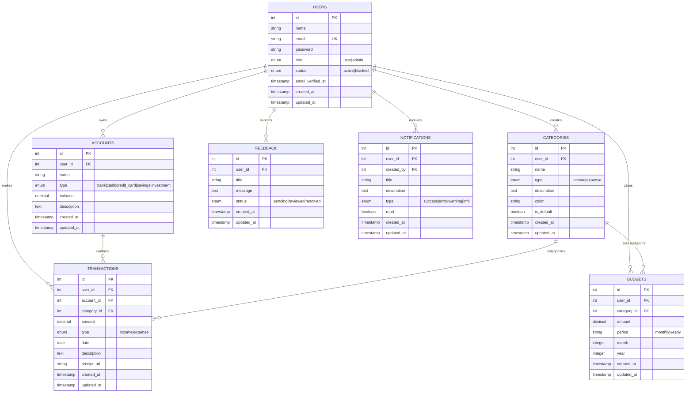

# Budget Tracker - Backend API Documentation

## Table of Contents
- [Overview](#overview)
- [Backend Development](#backend-development)
- [Folder Structure](#folder-structure)
- [Database Schema](#database-schema)
- [Security Implementation](#security-implementation)
- [API Documentation](#api-documentation)
- [Authentication & Authorization](#authentication--authorization)
- [Dependencies & Middleware](#dependencies--middleware)
- [Setup & Installation](#setup--installation)

---

## Overview

Budget Tracker is a comprehensive personal finance management system built with Laravel 11. The backend provides a RESTful API for managing users, accounts, transactions, categories, budgets, and feedback with robust authentication and authorization.

**Tech Stack:**
- Laravel 11.x
- PHP 8.2+
- PostgreSQL / MySQL
- Laravel Sanctum (API Authentication)
- Laravel Policies (Authorization)

---

## Backend Development

### Main Features Implemented

#### 1. **Authentication System**
- User registration with validation
- Email/password login with Sanctum token generation
- Password reset via email
- Token-based authentication for API requests
- Admin role-based access control

#### 2. **CRUD Operations**
The following modules have complete CRUD operations:
- **Accounts** - Bank accounts, cash, credit cards
- **Categories** - Income/expense categorization
- **Transactions** - Financial transactions tracking
- **Budgets** - Budget planning and monitoring
- **Feedback** - User feedback submission
- **Admin Panel** - User management, notifications

#### 3. **Security Features**

##### Input Sanitization
```php
// Implemented in Form Requests
- StoreAccountRequest
- UpdateAccountRequest
- StoreCategoryRequest
- StoreTransactionRequest
- StoreBudgetRequest
```

All inputs are validated using Laravel's built-in validation rules:
- Type validation (string, integer, decimal, date, email)
- Length constraints (max, min)
- Required fields
- Unique constraints
- Custom validation rules

##### Authentication Middleware
```php
// Sanctum Authentication
'auth:sanctum' - Validates API tokens
'admin' - Ensures user has admin role
'throttle:api' - Rate limiting (60 requests/minute)
'throttle:auth' - Auth rate limiting (10 requests/minute)
```

##### Password Hashing
```php
// RegisteredUserController.php
User::create([
    'password' => Hash::make($validated['password']),
]);

// Password verification happens automatically via Laravel's auth system
```

#### 4. **Main Controllers Implemented**

| Controller | Purpose | Key Methods |
|------------|---------|-------------|
| `AuthenticatedSessionController` | Login/Logout | `store()`, `destroy()` |
| `RegisteredUserController` | User registration | `store()` |
| `ForgotPasswordController` | Password reset | `sendResetLinkEmail()`, `reset()`, `verifyToken()` |
| `ProfileController` | User profile management | `updateProfileInformation()`, `updatePassword()`, `deleteAccount()` |
| `DashboardController` | Dashboard data | `index()`, `getStats()`, `getRecentTransactions()`, `getMonthlyAnalytics()` |
| `AccountController` | Account CRUD | `index()`, `store()`, `show()`, `update()`, `destroy()`, `transfer()` |
| `CategoryController` | Category CRUD | `index()`, `store()`, `show()`, `update()`, `destroy()` |
| `TransactionController` | Transaction CRUD | `index()`, `store()`, `show()`, `update()`, `destroy()`, `checkBudget()` |
| `BudgetController` | Budget CRUD | `index()`, `store()`, `show()`, `update()`, `destroy()` |
| `AnalyticsController` | Financial analytics | `monthly()`, `trends()`, `categoryBreakdown()`, `budgetPerformance()` |
| `FeedbackController` | Feedback system | `store()`, `myFeedback()`, `index()`, `show()`, `updateStatus()` |
| `Admin\UserManagementController` | User management | `index()`, `store()`, `update()`, `destroy()`, `block()`, `unblock()`, `statistics()` |
| `Admin\NotificationController` | Notifications | `index()`, `store()`, `recent()`, `unreadCount()`, `destroy()` |

---

## Folder Structure

```
budget-tracker/
│
├── app/
│   ├── Http/
│   │   ├── Controllers/
│   │   │   ├── Auth/                          # Authentication controllers
│   │   │   │   ├── AuthenticatedSessionController.php
│   │   │   │   ├── RegisteredUserController.php
│   │   │   │   ├── ForgotPasswordController.php
│   │   │   │   └── ...
│   │   │   ├── Admin/                         # Admin-only controllers
│   │   │   │   ├── UserManagementController.php
│   │   │   │   └── NotificationController.php
│   │   │   ├── AccountController.php          # Account management
│   │   │   ├── CategoryController.php         # Category management
│   │   │   ├── TransactionController.php      # Transaction management
│   │   │   ├── BudgetController.php           # Budget management
│   │   │   ├── FeedbackController.php         # Feedback system
│   │   │   ├── ProfileController.php          # User profile
│   │   │   ├── DashboardController.php        # Dashboard data
│   │   │   └── AnalyticsController.php        # Analytics & reports
│   │   │
│   │   ├── Middleware/
│   │   │   └── EnsureUserIsAdmin.php          # Admin authorization
│   │   │
│   │   ├── Requests/                          # Form validation requests
│   │   │   └── ProfileUpdateRequest.php
│   │   │
│   │   └── Traits/
│   │       └── HandlesApiResponses.php        # Consistent API responses
│   │
│   ├── Models/
│   │   ├── User.php                           # User model with roles
│   │   ├── Account.php                        # Bank accounts
│   │   ├── Category.php                       # Income/expense categories
│   │   ├── Transaction.php                    # Financial transactions
│   │   ├── Budget.php                         # Budget planning
│   │   ├── Feedback.php                       # User feedback
│   │   └── Notification.php                   # System notifications
│   │
│   ├── Policies/                              # Authorization policies
│   │   ├── AccountPolicy.php
│   │   ├── CategoryPolicy.php
│   │   ├── TransactionPolicy.php
│   │   └── BudgetPolicy.php
│   │
│   └── Providers/
│       ├── AppServiceProvider.php
│       └── AuthServiceProvider.php            # Register policies
│
├── config/
│   ├── auth.php                               # Authentication config
│   ├── sanctum.php                            # API token config
│   ├── cors.php                               # CORS configuration
│   └── database.php                           # Database configuration
│
├── database/
│   ├── migrations/                            # Database migrations
│   ├── seeders/                               # Database seeders
│   ├── factories/                             # Model factories
│   ├── budget_tracker_postgresql.sql          # PostgreSQL export
│   └── budget_tracker_mysql_export.sql        # MySQL export
│
├── routes/
│   ├── api.php                                # API routes
│   ├── auth.php                               # Authentication routes
│   └── web.php                                # Web routes
│
└── storage/
    ├── app/                                   # Application storage
    ├── framework/                             # Framework files
    └── logs/                                  # Application logs
```

---

## Database Schema

### Overview
The database consists of 7 main entities with relationships to support comprehensive financial tracking.

### Entity Relationship Diagram



### Database Exports
- **PostgreSQL**: `database/budget_tracker_postgresql.sql`
- **MySQL**: `database/budget_tracker_mysql_export.sql`
- **Migrations**: `database/migrations/*.php`

---

## Security Implementation

### 1. Input Sanitization & Validation

All user inputs are validated using Laravel Form Requests and validation rules:

```php
// Example: Transaction validation
public function rules(): array
{
    return [
        'account_id' => 'required|exists:accounts,id',
        'category_id' => 'required|exists:categories,id',
        'amount' => 'required|numeric|min:0.01',
        'type' => 'required|in:income,expense',
        'date' => 'required|date',
        'description' => 'nullable|string|max:500',
    ];
}
```

### 2. SQL Injection Prevention
- Eloquent ORM with parameterized queries
- All database queries use query builder or Eloquent
- No raw SQL without parameter binding

### 3. XSS Prevention
- All outputs escaped automatically by Laravel
- `htmlspecialchars()` applied to user content
- CSP headers configured

### 4. CSRF Protection
- CSRF tokens for web routes
- API routes use Sanctum token authentication

### 5. Mass Assignment Protection
```php
// Models specify fillable fields
protected $fillable = ['name', 'email', 'password'];
protected $guarded = ['id', 'role', 'status'];
```

### 6. Rate Limiting
```php
// API rate limiting
'throttle:api' => 60 requests per minute

// Auth rate limiting
'throttle:auth' => 10 requests per minute
```

### 7. Password Security
- Bcrypt hashing (cost factor: 12)
- Minimum 8 characters required
- Password confirmation required
- Reset tokens expire after 1 hour

---

## API Documentation

### Base URL
```
Production: https://budget-tracker-mhyx.onrender.com/api
Local: http://localhost:8000/api
```

### Authentication Header
```
Authorization: Bearer {token}
Content-Type: application/json
Accept: application/json
```

---

## Authentication Endpoints

### 1. Register User

**Endpoint:** `POST /api/register`

**Headers:**
```json
{
  "Content-Type": "application/json",
  "Accept": "application/json"
}
```

**Request Body:**
```json
{
  "name": "John Doe",
  "email": "john@example.com",
  "password": "password123",
  "password_confirmation": "password123"
}
```

**Success Response (201):**
```json
{
  "user": {
    "id": 1,
    "name": "John Doe",
    "email": "john@example.com",
    "role": "user",
    "status": "active",
    "created_at": "2025-12-16T10:00:00.000000Z"
  },
  "token": "1|abc123xyz456..."
}
```

**Error Response (422):**
```json
{
  "message": "The email has already been taken.",
  "errors": {
    "email": ["The email has already been taken."]
  }
}
```

**Functionality:** Creates a new user account with hashed password and generates API token.

---

### 2. Login

**Endpoint:** `POST /api/login`

**Headers:**
```json
{
  "Content-Type": "application/json",
  "Accept": "application/json"
}
```

**Request Body:**
```json
{
  "email": "john@example.com",
  "password": "password123"
}
```

**Success Response (200):**
```json
{
  "user": {
    "id": 1,
    "name": "John Doe",
    "email": "john@example.com",
    "role": "user",
    "status": "active"
  },
  "token": "2|xyz789abc123..."
}
```

**Error Response (401):**
```json
{
  "message": "Invalid credentials"
}
```

**Functionality:** Authenticates user and returns Sanctum API token for subsequent requests.

---

### 3. Forgot Password

**Endpoint:** `POST /api/forgot-password`

**Headers:**
```json
{
  "Content-Type": "application/json",
  "Accept": "application/json"
}
```

**Request Body:**
```json
{
  "email": "john@example.com"
}
```

**Success Response (200):**
```json
{
  "message": "Password reset link sent to your email"
}
```

**Error Response (404):**
```json
{
  "message": "User not found"
}
```

**Functionality:** Sends password reset link via email with time-limited token.

---

### 4. Reset Password

**Endpoint:** `POST /api/reset-password`

**Headers:**
```json
{
  "Content-Type": "application/json",
  "Accept": "application/json"
}
```

**Request Body:**
```json
{
  "token": "reset_token_from_email",
  "email": "john@example.com",
  "password": "newpassword123",
  "password_confirmation": "newpassword123"
}
```

**Success Response (200):**
```json
{
  "message": "Password reset successful"
}
```

**Error Response (400):**
```json
{
  "message": "Invalid or expired token"
}
```

**Functionality:** Resets user password using the token from email.

---

### 5. Logout

**Endpoint:** `POST /api/logout`

**Headers:**
```json
{
  "Authorization": "Bearer {token}",
  "Content-Type": "application/json",
  "Accept": "application/json"
}
```

**Success Response (200):**
```json
{
  "message": "Logged out successfully"
}
```

**Functionality:** Revokes the current API token.

---

## Account Management Endpoints

### 6. Get All Accounts

**Endpoint:** `GET /api/accounts`

**Headers:**
```json
{
  "Authorization": "Bearer {token}",
  "Accept": "application/json"
}
```

**Success Response (200):**
```json
{
  "data": [
    {
      "id": 1,
      "user_id": 1,
      "name": "Main Checking",
      "type": "bank",
      "balance": "5000.00",
      "description": "Primary bank account",
      "created_at": "2025-12-16T10:00:00.000000Z",
      "updated_at": "2025-12-16T10:00:00.000000Z"
    }
  ]
}
```

**Functionality:** Returns all accounts belonging to authenticated user.

---

### 7. Create Account

**Endpoint:** `POST /api/accounts`

**Headers:**
```json
{
  "Authorization": "Bearer {token}",
  "Content-Type": "application/json",
  "Accept": "application/json"
}
```

**Request Body:**
```json
{
  "name": "Savings Account",
  "type": "savings",
  "balance": 10000.00,
  "description": "Emergency fund"
}
```

**Success Response (201):**
```json
{
  "data": {
    "id": 2,
    "user_id": 1,
    "name": "Savings Account",
    "type": "savings",
    "balance": "10000.00",
    "description": "Emergency fund",
    "created_at": "2025-12-16T11:00:00.000000Z"
  }
}
```

**Error Response (422):**
```json
{
  "message": "The type field must be one of: bank, cash, credit_card, savings, investment.",
  "errors": {
    "type": ["The type field must be one of: bank, cash, credit_card, savings, investment."]
  }
}
```

**Functionality:** Creates a new account for the authenticated user.

---

### 8. Update Account

**Endpoint:** `PUT /api/accounts/{id}`

**Headers:**
```json
{
  "Authorization": "Bearer {token}",
  "Content-Type": "application/json",
  "Accept": "application/json"
}
```

**Request Body:**
```json
{
  "name": "Updated Savings Account",
  "balance": 12000.00
}
```

**Success Response (200):**
```json
{
  "data": {
    "id": 2,
    "name": "Updated Savings Account",
    "type": "savings",
    "balance": "12000.00",
    "description": "Emergency fund"
  }
}
```

**Error Response (403):**
```json
{
  "message": "Forbidden. You don't have permission to update this account."
}
```

**Functionality:** Updates account details. Only the account owner can update.

---

### 9. Delete Account

**Endpoint:** `DELETE /api/accounts/{id}`

**Headers:**
```json
{
  "Authorization": "Bearer {token}",
  "Accept": "application/json"
}
```

**Success Response (200):**
```json
{
  "message": "Account deleted successfully"
}
```

**Error Response (403):**
```json
{
  "message": "Forbidden"
}
```

**Functionality:** Soft deletes an account. Only the owner can delete.

---

### 10. Transfer Between Accounts

**Endpoint:** `POST /api/accounts/transfer`

**Headers:**
```json
{
  "Authorization": "Bearer {token}",
  "Content-Type": "application/json",
  "Accept": "application/json"
}
```

**Request Body:**
```json
{
  "from_account_id": 1,
  "to_account_id": 2,
  "amount": 500.00,
  "description": "Transfer to savings"
}
```

**Success Response (200):**
```json
{
  "message": "Transfer successful",
  "from_account": {
    "id": 1,
    "balance": "4500.00"
  },
  "to_account": {
    "id": 2,
    "balance": "10500.00"
  }
}
```

**Error Response (400):**
```json
{
  "message": "Insufficient balance"
}
```

**Functionality:** Transfers money between user's accounts atomically.

---

## Category Management Endpoints

### 11. Get All Categories

**Endpoint:** `GET /api/categories`

**Headers:**
```json
{
  "Authorization": "Bearer {token}",
  "Accept": "application/json"
}
```

**Success Response (200):**
```json
{
  "data": [
    {
      "id": 1,
      "user_id": 1,
      "name": "Groceries",
      "type": "expense",
      "description": "Food and household items",
      "color": "#FF5733",
      "is_default": false,
      "created_at": "2025-12-16T10:00:00.000000Z"
    }
  ]
}
```

**Functionality:** Returns all categories (user's custom + system defaults).

---

### 12. Create Category

**Endpoint:** `POST /api/categories`

**Headers:**
```json
{
  "Authorization": "Bearer {token}",
  "Content-Type": "application/json",
  "Accept": "application/json"
}
```

**Request Body:**
```json
{
  "name": "Entertainment",
  "type": "expense",
  "description": "Movies, games, events",
  "color": "#3498DB"
}
```

**Success Response (201):**
```json
{
  "data": {
    "id": 5,
    "name": "Entertainment",
    "type": "expense",
    "description": "Movies, games, events",
    "color": "#3498DB",
    "is_default": false
  }
}
```

**Error Response (422):**
```json
{
  "message": "The type field must be either income or expense.",
  "errors": {
    "type": ["The type field must be either income or expense."]
  }
}
```

**Functionality:** Creates a custom category for the user.

---

## Transaction Management Endpoints

### 13. Get All Transactions

**Endpoint:** `GET /api/transactions`

**Headers:**
```json
{
  "Authorization": "Bearer {token}",
  "Accept": "application/json"
}
```

**Query Parameters:**
```
?page=1
&per_page=20
&type=expense
&category_id=1
&account_id=1
&start_date=2025-01-01
&end_date=2025-12-31
&sort_by=date
&sort_order=desc
```

**Success Response (200):**
```json
{
  "data": [
    {
      "id": 1,
      "user_id": 1,
      "account_id": 1,
      "category_id": 1,
      "amount": "50.00",
      "type": "expense",
      "date": "2025-12-15",
      "description": "Weekly groceries",
      "account": {
        "id": 1,
        "name": "Main Checking"
      },
      "category": {
        "id": 1,
        "name": "Groceries",
        "color": "#FF5733"
      },
      "created_at": "2025-12-16T10:00:00.000000Z"
    }
  ],
  "meta": {
    "current_page": 1,
    "total": 150,
    "per_page": 20
  }
}
```

**Functionality:** Returns paginated list of transactions with filters and sorting.

---

### 14. Create Transaction

**Endpoint:** `POST /api/transactions`

**Headers:**
```json
{
  "Authorization": "Bearer {token}",
  "Content-Type": "application/json",
  "Accept": "application/json"
}
```

**Request Body:**
```json
{
  "account_id": 1,
  "category_id": 1,
  "amount": 75.50,
  "type": "expense",
  "date": "2025-12-16",
  "description": "Restaurant dinner"
}
```

**Success Response (201):**
```json
{
  "data": {
    "id": 50,
    "account_id": 1,
    "category_id": 1,
    "amount": "75.50",
    "type": "expense",
    "date": "2025-12-16",
    "description": "Restaurant dinner",
    "account": {
      "id": 1,
      "name": "Main Checking",
      "balance": "4924.50"
    }
  }
}
```

**Error Response (400):**
```json
{
  "message": "Insufficient balance in account"
}
```

**Functionality:** Creates a new transaction and updates account balance atomically.

---

### 15. Check Budget Before Transaction

**Endpoint:** `POST /api/transactions/check-budget`

**Headers:**
```json
{
  "Authorization": "Bearer {token}",
  "Content-Type": "application/json",
  "Accept": "application/json"
}
```

**Request Body:**
```json
{
  "category_id": 1,
  "amount": 100.00,
  "date": "2025-12-16"
}
```

**Success Response (200):**
```json
{
  "budget_exists": true,
  "budget_amount": "500.00",
  "spent_amount": "350.00",
  "remaining": "150.00",
  "will_exceed": false,
  "new_spent": "450.00",
  "percentage_used": 90,
  "warning": false
}
```

**Functionality:** Checks if transaction will exceed budget limits.

---

## Budget Management Endpoints

### 16. Get All Budgets

**Endpoint:** `GET /api/budgets`

**Headers:**
```json
{
  "Authorization": "Bearer {token}",
  "Accept": "application/json"
}
```

**Query Parameters:**
```
?month=12&year=2025
```

**Success Response (200):**
```json
{
  "data": [
    {
      "id": 1,
      "user_id": 1,
      "category_id": 1,
      "amount": "500.00",
      "period": "monthly",
      "month": 12,
      "year": 2025,
      "spent": "350.00",
      "remaining": "150.00",
      "percentage_used": 70,
      "category": {
        "id": 1,
        "name": "Groceries",
        "color": "#FF5733"
      }
    }
  ]
}
```

**Functionality:** Returns budgets with spending calculations for specified period.

---

### 17. Create Budget

**Endpoint:** `POST /api/budgets`

**Headers:**
```json
{
  "Authorization": "Bearer {token}",
  "Content-Type": "application/json",
  "Accept": "application/json"
}
```

**Request Body:**
```json
{
  "category_id": 1,
  "amount": 600.00,
  "period": "monthly",
  "month": 12,
  "year": 2025
}
```

**Success Response (201):**
```json
{
  "data": {
    "id": 5,
    "category_id": 1,
    "amount": "600.00",
    "period": "monthly",
    "month": 12,
    "year": 2025
  }
}
```

**Error Response (422):**
```json
{
  "message": "Budget already exists for this category and period",
  "errors": {
    "category_id": ["Budget already exists for this category and period"]
  }
}
```

**Functionality:** Creates a budget plan for a specific category and period.

---

## Dashboard & Analytics Endpoints

### 18. Get Dashboard Overview

**Endpoint:** `GET /api/dashboard`

**Headers:**
```json
{
  "Authorization": "Bearer {token}",
  "Accept": "application/json"
}
```

**Success Response (200):**
```json
{
  "total_income": "5000.00",
  "total_expenses": "3250.00",
  "net_savings": "1750.00",
  "account_count": 3,
  "total_balance": "12500.00",
  "budget_count": 5,
  "transaction_count": 42,
  "recent_transactions": []
}
```

**Functionality:** Returns summary statistics for dashboard display.

---

### 19. Get Monthly Analytics

**Endpoint:** `GET /api/analytics/monthly`

**Headers:**
```json
{
  "Authorization": "Bearer {token}",
  "Accept": "application/json"
}
```

**Query Parameters:**
```
?month=12&year=2025
```

**Success Response (200):**
```json
{
  "month": 12,
  "year": 2025,
  "total_income": "5000.00",
  "total_expenses": "3250.00",
  "net_balance": "1750.00",
  "daily_breakdown": [
    {
      "date": "2025-12-01",
      "income": "5000.00",
      "expenses": "150.00"
    }
  ],
  "top_categories": [
    {
      "name": "Groceries",
      "amount": "500.00",
      "percentage": 15.38
    }
  ]
}
```

**Functionality:** Provides detailed monthly financial analytics.

---

### 20. Get Category Breakdown

**Endpoint:** `GET /api/analytics/category-breakdown`

**Headers:**
```json
{
  "Authorization": "Bearer {token}",
  "Accept": "application/json"
}
```

**Query Parameters:**
```
?start_date=2025-01-01&end_date=2025-12-31&type=expense
```

**Success Response (200):**
```json
{
  "categories": [
    {
      "id": 1,
      "name": "Groceries",
      "color": "#FF5733",
      "total": "6000.00",
      "percentage": 30.5,
      "transaction_count": 24
    }
  ],
  "total_amount": "19672.50"
}
```

**Functionality:** Shows spending/income distribution by category.

---

## Feedback System Endpoints

### 21. Submit Feedback

**Endpoint:** `POST /api/feedback`

**Headers:**
```json
{
  "Authorization": "Bearer {token}",
  "Content-Type": "application/json",
  "Accept": "application/json"
}
```

**Request Body:**
```json
{
  "title": "Feature Request",
  "message": "Please add dark mode support"
}
```

**Success Response (201):**
```json
{
  "data": {
    "id": 10,
    "user_id": 1,
    "title": "Feature Request",
    "message": "Please add dark mode support",
    "status": "pending",
    "created_at": "2025-12-16T10:00:00.000000Z"
  },
  "message": "Feedback submitted successfully"
}
```

**Functionality:** Allows users to submit feedback/bug reports to admins.

---

### 22. Get My Feedback

**Endpoint:** `GET /api/feedback/my`

**Headers:**
```json
{
  "Authorization": "Bearer {token}",
  "Accept": "application/json"
}
```

**Success Response (200):**
```json
{
  "data": [
    {
      "id": 10,
      "title": "Feature Request",
      "message": "Please add dark mode support",
      "status": "pending",
      "created_at": "2025-12-16T10:00:00.000000Z"
    }
  ]
}
```

**Functionality:** Returns all feedback submitted by the authenticated user.

---

## Admin Endpoints

### 23. Get All Users (Admin Only)

**Endpoint:** `GET /api/admin/users`

**Headers:**
```json
{
  "Authorization": "Bearer {admin_token}",
  "Accept": "application/json"
}
```

**Query Parameters:**
```
?page=1&per_page=20&status=active&role=user&search=john
```

**Success Response (200):**
```json
{
  "data": [
    {
      "id": 1,
      "name": "John Doe",
      "email": "john@example.com",
      "role": "user",
      "status": "active",
      "email_verified_at": "2025-12-16T10:00:00.000000Z",
      "created_at": "2025-12-16T10:00:00.000000Z"
    }
  ],
  "meta": {
    "current_page": 1,
    "total": 100,
    "per_page": 20
  }
}
```

**Error Response (403):**
```json
{
  "message": "Forbidden. Admin access required."
}
```

**Functionality:** Returns paginated list of all users with filtering options. Admin only.

---

### 24. Block User (Admin Only)

**Endpoint:** `POST /api/admin/users/{id}/block`

**Headers:**
```json
{
  "Authorization": "Bearer {admin_token}",
  "Content-Type": "application/json",
  "Accept": "application/json"
}
```

**Request Body:**
```json
{
  "reason": "Terms of service violation"
}
```

**Success Response (200):**
```json
{
  "message": "User blocked successfully",
  "user": {
    "id": 5,
    "name": "Jane Smith",
    "status": "blocked"
  }
}
```

**Functionality:** Blocks a user account, preventing login.

---

### 25. Create Notification (Admin Only)

**Endpoint:** `POST /api/admin/notifications`

**Headers:**
```json
{
  "Authorization": "Bearer {admin_token}",
  "Content-Type": "application/json",
  "Accept": "application/json"
}
```

**Request Body:**
```json
{
  "title": "System Maintenance",
  "description": "Scheduled maintenance on Dec 20th",
  "type": "info",
  "user_id": null
}
```

**Success Response (201):**
```json
{
  "data": {
    "id": 50,
    "title": "System Maintenance",
    "description": "Scheduled maintenance on Dec 20th",
    "type": "info",
    "created_at": "2025-12-16T10:00:00.000000Z"
  },
  "message": "Notification sent to all users"
}
```

**Functionality:** Admin can send notifications to specific user or broadcast to all.

---

### 26. Get All Feedback (Admin Only)

**Endpoint:** `GET /api/admin/feedback`

**Headers:**
```json
{
  "Authorization": "Bearer {admin_token}",
  "Accept": "application/json"
}
```

**Query Parameters:**
```
?status=pending&page=1
```

**Success Response (200):**
```json
{
  "data": [
    {
      "id": 10,
      "user": {
        "id": 1,
        "name": "John Doe",
        "email": "john@example.com"
      },
      "title": "Feature Request",
      "message": "Please add dark mode support",
      "status": "pending",
      "created_at": "2025-12-16T10:00:00.000000Z"
    }
  ]
}
```

**Functionality:** Admin can view all user feedback with filtering by status.

---

### 27. Update Feedback Status (Admin Only)

**Endpoint:** `PATCH /api/admin/feedback/{id}/status`

**Headers:**
```json
{
  "Authorization": "Bearer {admin_token}",
  "Content-Type": "application/json",
  "Accept": "application/json"
}
```

**Request Body:**
```json
{
  "status": "resolved"
}
```

**Success Response (200):**
```json
{
  "data": {
    "id": 10,
    "status": "resolved",
    "updated_at": "2025-12-16T12:00:00.000000Z"
  },
  "message": "Feedback status updated"
}
```

**Functionality:** Admin can update feedback status (pending → reviewed → resolved).

---

## Notification Endpoints

### 28. Get Recent Notifications

**Endpoint:** `GET /api/notifications/recent`

**Headers:**
```json
{
  "Authorization": "Bearer {token}",
  "Accept": "application/json"
}
```

**Query Parameters:**
```
?limit=10
```

**Success Response (200):**
```json
{
  "data": [
    {
      "id": 50,
      "title": "Budget Alert",
      "description": "You've spent 90% of your Groceries budget",
      "type": "warning",
      "read": false,
      "created_at": "2025-12-16T10:00:00.000000Z"
    }
  ]
}
```

**Functionality:** Returns recent notifications for the authenticated user.

---

### 29. Get Unread Count

**Endpoint:** `GET /api/notifications/unread-count`

**Headers:**
```json
{
  "Authorization": "Bearer {token}",
  "Accept": "application/json"
}
```

**Success Response (200):**
```json
{
  "unread_count": 5
}
```

**Functionality:** Returns count of unread notifications.

---

## Profile Management Endpoints

### 30. Update Profile

**Endpoint:** `PUT /api/profile`

**Headers:**
```json
{
  "Authorization": "Bearer {token}",
  "Content-Type": "application/json",
  "Accept": "application/json"
}
```

**Request Body:**
```json
{
  "name": "John Updated",
  "email": "johnupdated@example.com"
}
```

**Success Response (200):**
```json
{
  "user": {
    "id": 1,
    "name": "John Updated",
    "email": "johnupdated@example.com"
  },
  "message": "Profile updated successfully"
}
```

**Functionality:** Updates user's name and email with validation.

---

### 31. Update Password

**Endpoint:** `PUT /api/password`

**Headers:**
```json
{
  "Authorization": "Bearer {token}",
  "Content-Type": "application/json",
  "Accept": "application/json"
}
```

**Request Body:**
```json
{
  "current_password": "oldpassword123",
  "password": "newpassword123",
  "password_confirmation": "newpassword123"
}
```

**Success Response (200):**
```json
{
  "message": "Password updated successfully"
}
```

**Error Response (422):**
```json
{
  "message": "Current password is incorrect",
  "errors": {
    "current_password": ["Current password is incorrect"]
  }
}
```

**Functionality:** Updates user password after verifying current password.

---

### 32. Delete Account

**Endpoint:** `DELETE /api/account`

**Headers:**
```json
{
  "Authorization": "Bearer {token}",
  "Content-Type": "application/json",
  "Accept": "application/json"
}
```

**Request Body:**
```json
{
  "password": "password123"
}
```

**Success Response (200):**
```json
{
  "message": "Account deleted successfully"
}
```

**Error Response (422):**
```json
{
  "message": "Password is incorrect"
}
```

**Functionality:** Soft deletes user account and all associated data.

---

## Authentication & Authorization

### Authentication Flow


### Authorization Levels

1. **Public Routes** - No authentication required
   - `/api/register`
   - `/api/login`
   - `/api/forgot-password`
   - `/api/reset-password`

2. **Authenticated Routes** - Requires valid token
   - All `/api/*` routes except public routes
   - User can only access their own data

3. **Admin Routes** - Requires admin role
   - All `/api/admin/*` routes
   - User management
   - System-wide notifications
   - Feedback management

### Policy-Based Authorization

Laravel Policies ensure users can only modify their own resources:

```php
// AccountPolicy.php
public function update(User $user, Account $account)
{
    return $user->id === $account->user_id;
}

// Applied automatically in controllers
$this->authorize('update', $account);
```

---

## Dependencies & Middleware

### PHP Dependencies (composer.json)

```json
{
  "require": {
    "php": "^8.2",
    "laravel/framework": "^11.0",
    "laravel/sanctum": "^4.0",
    "laravel/tinker": "^2.9",
    "guzzlehttp/guzzle": "^7.8"
  },
  "require-dev": {
    "fakerphp/faker": "^1.23",
    "laravel/pint": "^1.13",
    "mockery/mockery": "^1.6",
    "nunomaduro/collision": "^8.0",
    "pestphp/pest": "^2.0",
    "phpunit/phpunit": "^11.0"
  }
}
```

### Middleware Stack

#### Global Middleware
```php
// bootstrap/app.php
- TrustProxies
- HandleCors
- ValidatePostSize
- TrimStrings
- ConvertEmptyStringsToNull
```

#### Route Middleware
```php
// app/Http/Kernel.php
'auth:sanctum' => \Laravel\Sanctum\Http\Middleware\EnsureFrontendRequestsAreStateful::class
'admin' => \App\Http\Middleware\EnsureUserIsAdmin::class
'throttle' => \Illuminate\Routing\Middleware\ThrottleRequests::class
```

### Security Middleware

1. **CORS Middleware** (`config/cors.php`)
   ```php
   'allowed_origins' => [env('FRONTEND_URL')],
   'allowed_methods' => ['GET', 'POST', 'PUT', 'DELETE', 'OPTIONS'],
   'allowed_headers' => ['*'],
   'supports_credentials' => true,
   ```

2. **Rate Limiting**
   ```php
   // API routes: 60 requests/minute
   RateLimiter::for('api', function (Request $request) {
       return Limit::perMinute(60)->by($request->user()?->id ?: $request->ip());
   });

   // Auth routes: 10 requests/minute
   RateLimiter::for('auth', function (Request $request) {
       return Limit::perMinute(10)->by($request->ip());
   });
   ```

3. **Sanctum Authentication**
   - Stateful authentication for SPA
   - Token-based authentication for API
   - Automatic CSRF protection for cookies

4. **Admin Middleware** (`EnsureUserIsAdmin`)
   - Checks user role
   - Returns 403 for non-admin users

---

## Setup & Installation

### Prerequisites
- PHP 8.2+
- Composer
- PostgreSQL 15+ or MySQL 8+
- Node.js 18+ (for assets)

### Installation Steps

1. **Clone Repository**
   ```bash
   git clone <repository-url>
   cd budget-tracker
   ```

2. **Install Dependencies**
   ```bash
   composer install
   npm install
   ```

3. **Environment Configuration**
   ```bash
   cp .env.example .env
   php artisan key:generate
   ```

4. **Configure Database** (`.env`)
   ```env
   DB_CONNECTION=pgsql
   DB_HOST=127.0.0.1
   DB_PORT=5432
   DB_DATABASE=budget_tracker
   DB_USERNAME=postgres
   DB_PASSWORD=your_password
   
   FRONTEND_URL=http://localhost:5173
   SANCTUM_STATEFUL_DOMAINS=localhost:5173
   ```

5. **Run Migrations**
   ```bash
   php artisan migrate --seed
   ```

6. **Create Admin Account**
   ```bash
   php artisan tinker
   >>> User::create([
       'name' => 'Admin',
       'email' => 'admin@example.com',
       'password' => Hash::make('password123'),
       'role' => 'admin',
       'status' => 'active',
       'email_verified_at' => now()
   ]);
   ```

7. **Start Development Server**
   ```bash
   php artisan serve
   # API available at: http://localhost:8000/api
   ```

### Testing

```bash
# Run all tests
php artisan test

# Run specific test suite
php artisan test --testsuite=Feature

# Run with coverage
php artisan test --coverage
```

---

## Error Handling

### Standard Error Response Format

All API errors follow this format:

```json
{
  "message": "Human-readable error message",
  "errors": {
    "field_name": [
      "Specific validation error"
    ]
  }
}
```

### HTTP Status Codes

- `200 OK` - Successful GET, PUT, PATCH
- `201 Created` - Successful POST
- `204 No Content` - Successful DELETE
- `400 Bad Request` - Invalid request data
- `401 Unauthorized` - Missing or invalid token
- `403 Forbidden` - Insufficient permissions
- `404 Not Found` - Resource not found
- `422 Unprocessable Entity` - Validation errors
- `429 Too Many Requests` - Rate limit exceeded
- `500 Internal Server Error` - Server error

---

## Production Deployment

### Environment Variables (Production)

```env
APP_ENV=production
APP_DEBUG=false
APP_URL=https://your-domain.com

DB_CONNECTION=pgsql
DB_HOST=production-db-host
DB_DATABASE=budget_tracker_prod

FRONTEND_URL=https://frontend-domain.com
SANCTUM_STATEFUL_DOMAINS=frontend-domain.com

MAIL_MAILER=smtp
MAIL_HOST=smtp.mailtrap.io
MAIL_PORT=2525
```

### Production Checklist

- [ ] Set `APP_DEBUG=false`
- [ ] Configure production database
- [ ] Set up HTTPS/SSL
- [ ] Configure CORS for production domain
- [ ] Set up email service
- [ ] Configure rate limiting
- [ ] Set up logging and monitoring
- [ ] Run database migrations
- [ ] Optimize autoloader: `composer install --optimize-autoloader --no-dev`
- [ ] Cache configuration: `php artisan config:cache`
- [ ] Cache routes: `php artisan route:cache`

---

## Support & Documentation

### Additional Resources

- **Laravel Documentation**: https://laravel.com/docs/11.x
- **Laravel Sanctum**: https://laravel.com/docs/11.x/sanctum
- **Database Exports**: `/database/*.sql`
- **Migration Files**: `/database/migrations/`
- **ERD Diagram**: `/ERD.md`
- **Backend Notes**: `/BACKEND_NOTES.md`

### Contact & Support

For bugs, feature requests, or questions:
- Submit feedback via the app
- Create an issue in the repository
- Contact the development team

---

## License

This project is proprietary and confidential. Unauthorized copying, distribution, or use is strictly prohibited.

---

**Last Updated:** December 16, 2025  
**Version:** 1.0.0  
**Maintained by:** Budget Tracker Development Team
