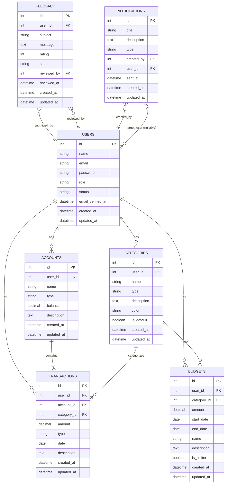

# Budget Tracker — ERD

Below is an Entity-Relationship Diagram (Mermaid) and a concise listing of entities and relationships inferred from the Eloquent models in this repository.

**Entities & important fields**

- **User**: id, name, email, password, role, status
- **Account**: id, user_id (FK), name, type, balance, description
- **Category**: id, user_id (FK), name, type (income|expense), color, is_default
- **Transaction**: id, user_id (FK), account_id (FK), category_id (FK), amount, type (income|expense), date, description
- **Budget**: id, user_id (FK), category_id (FK), amount, start_date, end_date, is_limiter
- **Feedback**: id, user_id (FK), subject, message, rating, status, reviewed_by (FK)
- **Notification**: id, title, description, type, created_by (FK), user_id (FK nullable), sent_at

**Relationship summary**

- `User` 1 — * `Account` (user owns many accounts)
- `User` 1 — * `Category` (user's categories)
- `User` 1 — * `Transaction` (user's transactions)
- `User` 1 — * `Budget` (user's budgets)
- `Account` 1 — * `Transaction` (account transactions)
- `Category` 1 — * `Transaction` (transactions assigned to a category)
- `Category` 1 — * `Budget` (category budgets)
- `Feedback` belongs to `User` (submitted_by) and optionally references a reviewer (`reviewed_by`)
- `Notification` created_by -> `User`; `Notification.user_id` nullable = targeted user; null = broadcast

If you'd like, I can:

- Render this Mermaid diagram to PNG/SVG and save to the repo.
- Generate a PlantUML or DOT version instead.
